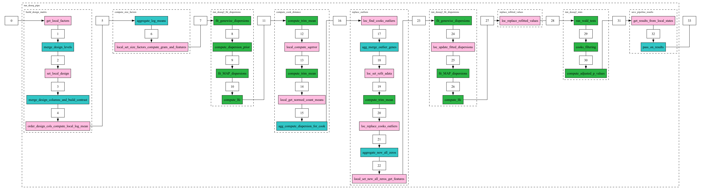

# Core of the fed-pydeseq2 package: `deseq2_core`

## Workflow graph

The workflow graph below illustrates the sequence of operations in the design matrix construction process. It shows how data flows between local centers and the aggregation server during the `run_deseq_pipe` function.

For a detailed breakdown of the shared states and their contents at each step, please refer to the table below.

# API

The core of the fed-pydeseq2 package is encapsulated in the following Mixin class.

::: fedpydeseq2.core.deseq2_core.deseq2_full_pipe

# Steps of fedpydeseq2 and corresponding Mixin classes.

## Building the design matrix: [build_design_matrix](build_design_matrix/build_design_matrix.md)

## Computing the size factors: [compute_size_factors](compute_size_factors/compute_size_factors.md)

## Computing log fold changes and dispersions: [deseq2_lfc_dispersions](deseq2_lfc_dispersions/deseq2_lfc_dispersions.md)

## Computing the cooks distance: [compute_cook_distance](compute_cook_distance/compute_cook_distance.md)

## Replacing outliers: [replace_outliers](replace_outliers/replace_outliers.md)

## Replace refitted values: [replace_refitted_values](replace_refitted_values/replace_refitted_values.md)

## Computing statistics: [deseq2_stats](deseq2_stats/deseq2_stats.md)

## Saving the results: [save_pipeline_results](save_pipeline_results/save_pipeline_results.md)

# Table with shared quantities between centers and server


