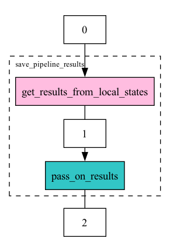

# Workflow graph

The workflow graph below illustrates the sequence of operations in the design matrix construction process. It shows how data flows between local centers and the aggregation server during the `save_pipeline_results` function.

For a detailed breakdown of the shared states and their contents at each step, please refer to the table below.

# API

::: fedpydeseq2.core.deseq2_core.save_pipeline_results
    options:
        show_submodules: true

# Table with shared quantities between centers and server


